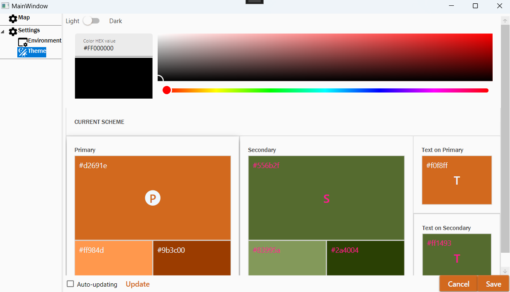

# GeoPathGenerator

Utility for generating paths based on points and contours on the map.

It is assumed that there will be a pattern system for inserting coordinates in certain places.
At the moment, the project is absolutely not fulfilling its functions.

# Roadmap
1) Add the ability to add points to the map
2) The points must have a certain "order" to connect the points in one path.
3) Add groups for different points
4) Add the ability to hide groups and points.
5) Redesign the menu and theme settings.

# Screenshots 

The screenshot below shows the interaction of the settings sliders and elements.

## Functionality
# Auto-update & Update

It is assumed that the settings file can be changed, for this the application polls the settings file every 2 seconds.

The Update button has 2 states: inactive and active. In active mode, the user can cancel the iteration of updating the settings from the file. In inactive mode, it can force the update operation of the settings from the file.

